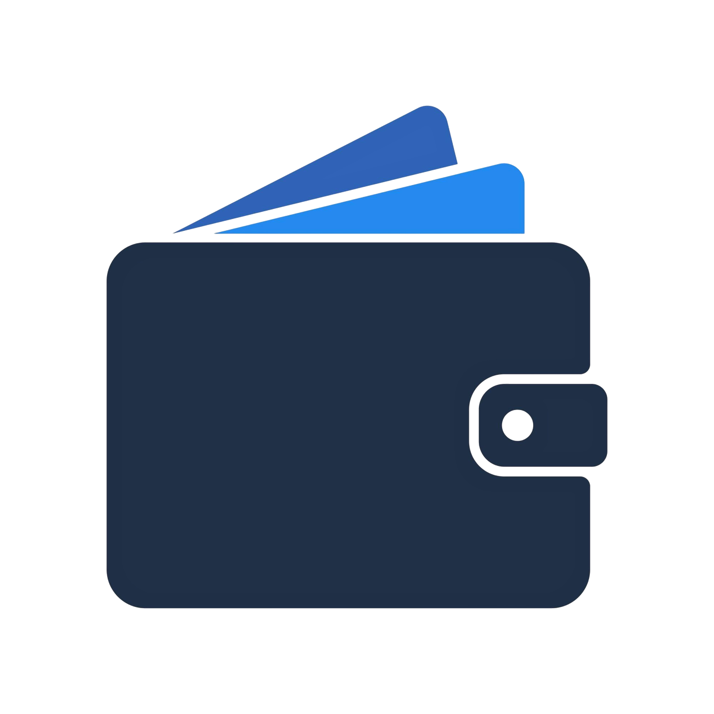

#  FinTrack

## Gestão Financeira para Microempreendedores (MEI)

O **FinTrack** é um **projeto pessoal Full Stack** desenvolvido para oferecer controle financeiro simplificado e seguro para microempreendedores. Como também sou MEI, projetei esta ferramenta para resolver as dores reais de quem precisa de agilidade, clareza e segurança na gestão do fluxo de caixa diário.

---

## Funcionalidades

- **Autenticação Segura:** Registro e login de usuários com criptografia de senhas (Bcrypt) e tokens JWT.
- **Verificação em Duas Etapas (2FA):** Sistema de validação de conta via e-mail utilizando um código de 6 dígitos.
- **Recuperação de Senha Completa:** Fluxo em etapas para redefinição segura de senha via código de verificação por e-mail.
- **Dashboard Financeiro:** Visualização intuitiva de saldos, entradas e saídas.
- **CRUD de Transações:** Gerenciamento completo (Criar, Ler, Editar e Deletar) de ganhos e despesas.
- **Interface Dark Mode:** Design responsivo e moderno otimizado para produtividade (Tailwind CSS).

---

## 🛠️ Tecnologias Utilizadas

### Frontend

- [React.js](https://reactjs.org/) (Vite)
- [Tailwind CSS](https://tailwindcss.com/) (Estilização)
- [Axios](https://axios-http.com/) (Consumo de API)
- [SweetAlert2](https://sweetalert2.github.io/) (Alertas e Modais)

### Backend

- [Node.js](https://nodejs.org/) & [Express](https://expressjs.com/) (TypeScript / JavaScript)
- [MongoDB Atlas](https://www.mongodb.com/atlas) (Banco de Dados NoSQL)
- [Mongoose](https://mongoosejs.com/) (Modelagem de dados)
- [Brevo API](https://www.brevo.com/) (Disparo de e-mails transacionais e códigos OTP)
- [JWT](https://jwt.io/) & [Bcrypt](https://github.com/dcodeIO/bcrypt.js) (Autenticação e segurança)

---

## Como Executar o Projeto

### Pré-requisitos

- Node.js instalado (v18 ou superior recomendado)
- Conta no MongoDB Atlas
- Chave de API do Brevo (para envio de e-mails)

### 1. Clonar o Repositório

```bash
Clone o projeto

git clone [https://github.com/Juan-s-moreira/fintrack.git](https://github.com/Juan-s-moreira/fintrack.git)

Entre na pasta do projeto

cd fintrack
2. Configurar o Backend

Entre na pasta do servidor

cd backend

Instale as dependências

npm install

Configure as variáveis de ambiente (.env)
Crie um arquivo .env e adicione:

MONGO_URI=seu_link_do_mongodb
JWT_SECRET=sua_chave_secreta
BREVO_API_KEY=sua_chave_api_brevo
EMAIL_USER=seu_email_validado@gmail.com
PORT=3000

Inicie o servidor

npm start
3. Configurar o Frontend

cd frontend

npm install

npm run dev


🔮 Roadmap (Funcionalidades Futuras)
[ ] Date Picker: Seleção de datas personalizadas para registros históricos.

[ ] PWA (Progressive Web App): Em produção para permitir instalação como aplicativo mobile.

[ ] Relatórios PDF: Exportação de relatórios mensais de movimentações.

[ ] Gráficos Dinâmicos: Visualização de evolução financeira com Chart.js.


📄 Licença
Este projeto está sob a licença MIT. Veja o arquivo LICENSE para mais detalhes.

Desenvolvido por [Juan Santos]
```
